# 🚀 DOCX Agent Backend API

A FastAPI backend that makes your LangGraph DOCX agent accessible as a bot across multiple platforms. This backend handles session management, approval workflows, and provides a clean REST API for integration.

## 📋 Table of Contents

- [Features](#features)
- [Architecture](#architecture)
- [Quick Start](#quick-start)
- [API Documentation](#api-documentation)
- [Human-in-the-Loop Explained](#human-in-the-loop-explained)
- [Integration Guide](#integration-guide)
- [Deployment](#deployment)
- [Troubleshooting](#troubleshooting)

## ✨ Features

- **Multi-Platform Support**: Use the same agent across different chat platforms
- **Session Management**: Automatic conversation tracking per user
- **Approval Workflow**: Human-in-the-loop for critical operations (write operations)
- **Thread Persistence**: Conversation history maintained across interactions
- **REST API**: Clean, documented API for easy integration
- **Health Monitoring**: Built-in health checks and status endpoints

## 🏗️ Architecture

```
┌─────────────────┐
│  Chat Platform  │  (Telegram, Discord, Slack, etc.)
└────────┬────────┘
         │
         ▼
┌─────────────────┐
│  Backend API    │  (FastAPI - Port 8000)
│  - Session Mgmt │
│  - Approval Flow│
└────────┬────────┘
         │
         ▼
┌─────────────────┐
│  LangGraph      │  (Port 8123 or local)
│  DOCX Agent     │
└─────────────────┘
```

## 🚀 Quick Start

### 1. Install Dependencies

```bash
cd backend
pip install -r requirements.txt
```

### 2. Configure Environment

```bash
# Copy the example environment file
cp .env.example .env

# Edit .env with your settings
nano .env
```

Required settings:
- `LANGGRAPH_URL`: URL of your LangGraph server (default: `http://localhost:8123`)
- `OPENAI_API_KEY`: Your OpenAI API key

### 3. Start the LangGraph Server (if using local)

In a separate terminal:

```bash
cd ../main
export OPENAI_API_KEY="your-key-here"
langgraph dev
```

### 4. Start the Backend Server

```bash
cd backend
python app.py
```

Or using uvicorn directly:

```bash
uvicorn app:app --host 0.0.0.0 --port 8000 --reload
```

### 5. Test the API

Visit: http://localhost:8000/docs for interactive API documentation

Or test with curl:

```bash
curl -X POST "http://localhost:8000/api/chat" \
  -H "Content-Type: application/json" \
  -d '{
    "user_id": "test_user_123",
    "message": "Show me the document outline",
    "platform": "api"
  }'
```

## 📚 API Documentation

### Core Endpoints

#### `POST /api/chat`

Send a message to the agent.

**Request:**
```json
{
  "user_id": "user123",
  "message": "Update section 2.1 to say 'Company Overview'",
  "platform": "api",
  "metadata": {}
}
```

**Response (Normal):**
```json
{
  "message": "Here's the information you requested...",
  "requires_approval": false,
  "session_id": "abc-123-def",
  "status": "completed"
}
```

**Response (Approval Required):**
```json
{
  "message": "🔔 **Approval Required**\n\n**Edit Operation**\n- Location: [\"body\", 0, 0, 0, 95]\n- New text: Company Overview\n\nReply with:\n• `/approve` or `yes` to proceed\n• `/reject` or `no` to cancel",
  "requires_approval": true,
  "approval_data": {
    "type": "approval_request",
    "tool_name": "apply_edit",
    "tool_call_id": "xyz",
    "args": {...},
    "description": "..."
  },
  "session_id": "abc-123-def",
  "status": "waiting_approval"
}
```

#### `POST /api/approve`

Respond to an approval request.

**Request:**
```json
{
  "user_id": "user123",
  "session_id": "abc-123-def",
  "approved": true,
  "platform": "api"
}
```

**Response:**
```json
{
  "message": "✅ Operation approved and executed successfully",
  "requires_approval": false,
  "session_id": "abc-123-def",
  "status": "completed"
}
```

#### `GET /api/sessions/{user_id}`

Get all sessions for a user.

#### `DELETE /api/sessions/{session_id}`

Delete a session.

#### `GET /health`

Health check endpoint.

## 🔄 Human-in-the-Loop Explained

### The Confusion Clarified

LangGraph's documentation shows using `interrupt()` which works great in **LangGraph Studio**, but for chat platforms, you need a different approach:

#### Approach 1: LangGraph Studio (Original Docs)
```python
# In your graph
value = interrupt({"description": "Approve this?"})
# User responds through SDK
client.runs.wait(thread_id, command=Command(resume="yes"))
```

**Problem**: Requires LangGraph SDK client and doesn't work naturally in chat platforms.

#### Approach 2: Chat Platform Flow (This Backend)
```
1. User: "Update section 2.1"
2. Agent: "🔔 Approval Required: [details]"
3. User: "/approve" or "yes"
4. Agent: "✅ Operation executed"
```

**Solution**: The backend translates between:
- LangGraph's interrupt-based approvals
- Natural chat message exchanges

### How It Works

```mermaid
sequenceDiagram
    User->>Backend: "Update document"
    Backend->>LangGraph: Process message
    LangGraph->>Backend: interrupt() triggered
    Backend->>Session: Store pending approval
    Backend->>User: "Approval required?"
    User->>Backend: "yes"
    Backend->>LangGraph: Resume with approval
    LangGraph->>Backend: Execute & respond
    Backend->>User: "✅ Done!"
```



### Two Modes Supported

**Mode 1: Remote LangGraph Server**
- Backend connects to LangGraph server via SDK
- Uses `interrupt()` and `Command(resume=...)`
- Best for production deployments

**Mode 2: Local Graph Execution**
- Backend imports graph directly
- Simulates approval flow
- Best for development/testing

Configure in `.env`:
```bash
# For remote server
LANGGRAPH_URL=http://localhost:8123

# For local execution
# LANGGRAPH_URL=  # Leave empty or comment out
```

## 🔌 Integration Guide

### Generic REST API Integration

Any platform can integrate using the REST API:

```python
import requests

# Send a message
response = requests.post("http://localhost:8000/api/chat", json={
    "user_id": "user123",
    "message": "Search for 'project timeline'",
    "platform": "my_platform"
})

result = response.json()

if result["requires_approval"]:
    # Show approval UI to user
    print(result["message"])
    
    # Get user's decision
    user_decision = input("Approve? (yes/no): ")
    
    # Send approval response
    approval_response = requests.post("http://localhost:8000/api/approve", json={
        "user_id": "user123",
        "session_id": result["session_id"],
        "approved": user_decision.lower() in ["yes", "y", "approve"]
    })
    
    print(approval_response.json()["message"])
else:
    print(result["message"])
```

### Platform-Specific Examples

#### Telegram Bot
```python
from telegram import Update
from telegram.ext import Application, CommandHandler, MessageHandler

async def handle_message(update: Update, context):
    response = requests.post("http://localhost:8000/api/chat", json={
        "user_id": f"telegram_{update.effective_user.id}",
        "message": update.message.text,
        "platform": "telegram"
    })
    
    result = response.json()
    
    if result["requires_approval"]:
        # Add inline buttons
        keyboard = [[
            InlineKeyboardButton("✅ Approve", callback_data="approve"),
            InlineKeyboardButton("❌ Reject", callback_data="reject")
        ]]
        reply_markup = InlineKeyboardMarkup(keyboard)
        await update.message.reply_text(result["message"], reply_markup=reply_markup)
    else:
        await update.message.reply_text(result["message"])
```

#### Discord Bot
```python
import discord

@client.event
async def on_message(message):
    response = requests.post("http://localhost:8000/api/chat", json={
        "user_id": f"discord_{message.author.id}",
        "message": message.content,
        "platform": "discord"
    })
    
    result = response.json()
    
    if result["requires_approval"]:
        view = ApprovalView(result["session_id"], message.author.id)
        await message.channel.send(result["message"], view=view)
    else:
        await message.channel.send(result["message"])
```

#### Slack Bot
```python
@app.event("message")
def handle_message(event, say):
    response = requests.post("http://localhost:8000/api/chat", json={
        "user_id": f"slack_{event['user']}",
        "message": event["text"],
        "platform": "slack"
    })
    
    result = response.json()
    
    if result["requires_approval"]:
        say(
            text=result["message"],
            blocks=[{
                "type": "actions",
                "elements": [
                    {"type": "button", "text": {"type": "plain_text", "text": "Approve"}, "value": "approve"},
                    {"type": "button", "text": {"type": "plain_text", "text": "Reject"}, "value": "reject"}
                ]
            }]
        )
    else:
        say(result["message"])
```

## 🚢 Deployment

### Docker Deployment

Create `Dockerfile`:

```dockerfile
FROM python:3.11-slim

WORKDIR /app

COPY requirements.txt .
RUN pip install --no-cache-dir -r requirements.txt

COPY . .

EXPOSE 8000

CMD ["uvicorn", "app:app", "--host", "0.0.0.0", "--port", "8000"]
```

Build and run:

```bash
docker build -t docx-agent-backend .
docker run -p 8000:8000 --env-file .env docx-agent-backend
```

### Production Deployment

Using Gunicorn + Uvicorn workers:

```bash
gunicorn app:app \
  --workers 4 \
  --worker-class uvicorn.workers.UvicornWorker \
  --bind 0.0.0.0:8000 \
  --timeout 120
```

### Environment Variables for Production

```bash
# Production settings
DEBUG=false
LANGGRAPH_URL=https://your-langgraph-deployment.com
SESSION_TIMEOUT_MINUTES=30

# Security
# Add API key authentication if needed
# API_KEY=your-secret-key
```

## 🐛 Troubleshooting

### Issue: "Cannot connect to LangGraph server"

**Solution:**
1. Make sure LangGraph server is running: `langgraph dev`
2. Check `LANGGRAPH_URL` in `.env`
3. Try local execution mode (leave `LANGGRAPH_URL` empty)

### Issue: "Approval not working"

**Solution:**
1. Check that the docx_agent (which includes approval flow) is properly integrated in `main/src/agent/graph.py`
2. Verify session is properly stored: `GET /api/sessions/{user_id}`
3. Check logs for interrupt handling

### Issue: "Session timeout"

**Solution:**
- Increase `SESSION_TIMEOUT_MINUTES` in `.env`
- Sessions are cleaned up automatically after inactivity

### Issue: "Multiple sessions for same user"

**Solution:**
- Use `DELETE /api/sessions/{session_id}` to clear old sessions
- Or implement session reset in your bot UI

## 📊 Monitoring

### Health Check

```bash
curl http://localhost:8000/health
```

Response:
```json
{
  "status": "healthy",
  "timestamp": "2025-09-30T10:30:00.000Z",
  "active_sessions": 5
}
```

### View Active Sessions

```bash
curl http://localhost:8000/api/sessions
```

## 🎯 Next Steps

1. **Add Authentication**: Implement API key or OAuth for production
2. **Rate Limiting**: Add rate limiting to prevent abuse
3. **Logging**: Implement structured logging for monitoring
4. **Analytics**: Track usage patterns and approval rates
5. **Webhooks**: Add webhook support for async notifications
6. **Platform Integrations**: Create full bot implementations for specific platforms

## 📝 License

Same as the main DOCX-agent project.

## 🤝 Contributing

Contributions welcome! Please test your changes with both local and remote LangGraph modes.

---

**Built with ❤️ using FastAPI and LangGraph**
