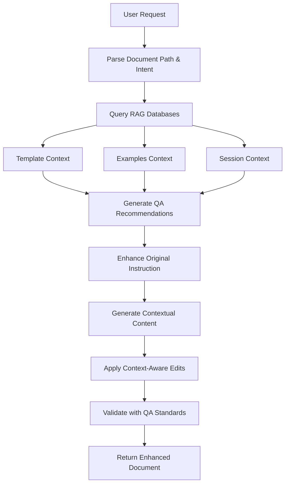

# Context-Aware Word Document Editing System

## Overview

This system provides intelligent Word document editing capabilities with **context awareness** through RAG (Retrieval-Augmented Generation) and QA (Quality Assurance) integration. When you provide a document path and editing instructions, the system:

1. **Analyzes your request** for intent and requirements
2. **Queries RAG databases** for relevant context from templates, examples, and sessions
3. **Applies QA standards** to ensure professional quality
4. **Generates enhanced content** using contextual intelligence
5. **Edits the document** with professional formatting and standards

## How It Works

### 🎯 **Request Flow**

```
User Input → Context Analysis → RAG Query → QA Enhancement → Document Edit → Validation
```

### 🔍 **Context Intelligence Pipeline**

#### 1. **RAG Database Integration**
- **Template Database** (`template_rag.db`): Document structures, formats, and professional patterns
- **Examples Database** (`rfp_rag.db`): Similar successful documents and editing examples  
- **Session Database** (`session.db`): Previous conversation context and user preferences

#### 2. **QA Enhancement System**
- **Quality Standards**: Professional language, clear communication, business standards
- **Formatting Standards**: Consistent structure, proper headings, professional presentation
- **Consistency Checks**: Alignment with existing content and document standards
- **Risk Assessment**: Potential conflicts or issues identification
- **Validation Requirements**: Compliance verification and quality assurance

#### 3. **Context-Aware Content Generation**
- **Semantic Analysis**: Understanding the intent behind editing requests
- **Template Pattern Matching**: Finding relevant document structures from knowledge base
- **Enhanced Content Creation**: Generating professional content with contextual intelligence
- **QA Compliance Integration**: Ensuring all content meets quality standards

## System Architecture

### 📁 **Core Components**

#### **ContextAwareWordEditorAgent** (`src/agent/word_editor_agent.py`)
- Main orchestrator for context-aware document editing
- Integrates MCP client for Word document manipulation
- Coordinates RAG queries and QA recommendations
- Manages async operations and error handling

```python
class ContextAwareWordEditorAgent:
    - edit_document_section()       # Main entry point
    - _get_context_from_embeddings() # RAG database queries
    - _get_qa_recommendations()     # QA standards application
    - _enhance_instruction_with_context() # Context integration
    - _process_document_edit_with_context() # Document manipulation
```

#### **RAG Integration** (`ProposalRAGCoordinator`)
- Coordinates queries across multiple knowledge bases
- Provides template patterns, examples, and session context
- Uses OpenAI embeddings (text-embedding-3-large) for semantic search
- Ensures contextual relevance in document generation

#### **LangGraph Routing** (`src/agent/router.py` & `src/agent/graph.py`)
- **Priority Routing**: Word editing requests get highest priority
- **Conditional Logic**: Automatically detects document editing intents
- **Workflow Integration**: Seamlessly integrates with existing multi-agent system

### 🔧 **Technical Stack**

#### **MCP (Model Context Protocol)**
- **Office-Word-MCP-Server v1.1.10**: 54+ professional document tools
- **Standardized Communication**: Client-server architecture for document operations
- **Async Operations**: Non-blocking document manipulation with proper error handling

#### **Document Operations Available**
```python
# Document Creation & Management
- create_document()         # Create new .docx files
- get_document_info()       # Retrieve document statistics
- save_document()          # Persist changes

# Content Addition & Modification  
- add_heading()            # Professional headings with levels
- add_paragraph()          # Rich text paragraphs
- add_table()             # Structured data tables
- search_and_replace()     # Precision text replacement

# Advanced Formatting
- set_document_properties()  # Metadata and properties
- add_page_break()         # Document structure
- format_text()           # Rich text formatting
```

#### **Context Enhancement Process**



## Usage Examples

### 🎯 **Basic Document Editing**
```bash
"edit document /path/to/proposal.docx - add pricing section with 15% discount"
```

**What happens:**
1. System queries pricing templates from RAG database
2. Applies QA standards for professional pricing presentation
3. Generates context-aware pricing table with discount structure
4. Adds professional formatting and business language

### 📊 **Context-Aware Table Generation**
```bash
"update /home/user/contract.docx add timeline table"
```

**Context Enhancement:**
- Queries similar contract timelines from examples database
- Applies professional project management standards
- Generates structured timeline with phases and deliverables
- Ensures consistency with existing contract language

### 🔄 **Smart Content Replacement**
```bash
"change contract.docx replace old terms with updated compliance requirements"
```

**Intelligent Processing:**
- Identifies terms that need updating using context analysis
- Queries compliance templates for current standards  
- Applies QA recommendations for legal language
- Ensures consistency across document sections

## Integration Points

### 🤖 **LangGraph Multi-Agent System**

#### **Router Priority Logic** (`src/agent/router.py`)
```python
# Word editing gets highest priority
if any(word in message.lower() for word in [
    'edit document', 'update document', 'modify document',
    'change document', 'add to document', '.docx'
]):
    return "word_editor"
```

#### **Graph Node Integration** (`src/agent/graph.py`)
```python
# Word editor node in workflow
graph.add_node("word_editor", word_editor_agent.edit_document_section)
graph.add_conditional_edges("router", route_request)
```

### 💾 **Database Architecture**

#### **RAG Databases**
- **`template_rag.db`**: Document templates and structures
- **`rfp_rag.db`**: RFP examples and successful responses
- **`session.db`**: Conversation history and user context

#### **Embedding Strategy**
- **Model**: OpenAI text-embedding-3-large (3,072 dimensions)
- **Chunking**: Intelligent document section splitting
- **Similarity Search**: Top-k retrieval with relevance scoring
- **Context Window**: Optimized for quality vs. performance

### 🔧 **Development Environment**

#### **Dependencies** (`requirements.txt`)
```txt
office-word-mcp-server>=1.1.10   # Word document manipulation
nest-asyncio>=1.5.6              # Async event loop handling  
langchain-openai                 # LLM and embeddings
mcp                             # Model Context Protocol client
```

#### **Environment Configuration**
```bash
OPENAI_API_KEY=your_openai_key    # For LLM and embeddings
LLM_MODEL=gpt-4o-mini            # Default model for content generation
```

## Quality Assurance Features

### ✅ **Automatic QA Integration**

#### **Content Quality Standards**
- **Professional Language**: Business-appropriate tone and terminology
- **Clear Communication**: Concise, actionable, and well-structured content
- **Consistency**: Alignment with existing document patterns and style
- **Completeness**: Comprehensive coverage of requested changes

#### **Formatting Standards**  
- **Document Structure**: Proper headings, sections, and organization
- **Visual Consistency**: Uniform formatting across document elements
- **Professional Presentation**: Tables, lists, and content layout
- **Accessibility**: Clear hierarchy and readable structure

#### **Validation Process**
- **Pre-Edit Analysis**: Requirements validation and risk assessment
- **Context Verification**: Ensuring relevant knowledge base integration
- **Post-Edit Review**: Quality compliance and consistency checking
- **Error Handling**: Graceful failure recovery and user feedback

## Advanced Features

### 🧠 **Contextual Intelligence**

#### **Semantic Understanding**
- **Intent Recognition**: Understanding editing goals beyond literal instructions  
- **Context Relevance**: Matching appropriate knowledge base content
- **Professional Enhancement**: Elevating basic requests to business standards
- **Consistency Maintenance**: Ensuring coherent document evolution

#### **Dynamic Content Generation**
- **Template-Driven**: Using successful patterns from knowledge base
- **QA-Enhanced**: Professional quality standards automatically applied  
- **Context-Aware**: Relevant business knowledge integrated seamlessly
- **User-Personalized**: Learning from session history and preferences

### 🔄 **Error Handling & Recovery**

#### **Robust Operation**
- **MCP Connection Management**: Automatic server lifecycle handling
- **Database Fallbacks**: Graceful degradation when RAG unavailable
- **Document Backup**: Original preservation during editing operations
- **User Feedback**: Clear error messages and resolution guidance

#### **Performance Optimization**
- **Async Operations**: Non-blocking document processing
- **Efficient Queries**: Optimized RAG database interactions
- **Caching Strategy**: Reduced redundant operations
- **Resource Management**: Memory and connection lifecycle control

## Getting Started

### 🚀 **Installation**
```bash
cd /home/arun/Pictures/rfp-bid/main
pip install -r requirements.txt
```

### 📝 **Basic Usage**
```python
from src.agent.word_editor_agent import ContextAwareWordEditorAgent

agent = ContextAwareWordEditorAgent()

# Create state with user message
state = {
    "messages": [HumanMessage(content="edit document /path/to/doc.docx - add professional summary")]
}

# Process with context awareness
result = agent.edit_document_section(state)
```

### 🔧 **Integration with LangGraph**
The word editor automatically integrates with your existing LangGraph workflow:

1. **Router Detection**: Automatically identifies document editing requests
2. **Priority Processing**: Word editing gets precedence over other operations  
3. **Context Integration**: RAG and QA enhancement applied transparently
4. **Seamless Return**: Results integrate back into conversation flow

## Benefits

### 🎯 **For Users**
- **Natural Language Interface**: Edit documents using conversational instructions
- **Professional Quality**: Automatic business standards and formatting applied
- **Context Intelligence**: Leverages your existing knowledge base for better results
- **Consistency Assurance**: Maintains coherence across document modifications
- **Time Efficiency**: Reduces manual formatting and content generation effort

### 🛠️ **For Developers**
- **Modular Architecture**: Clean separation of concerns and reusable components
- **Extensible Design**: Easy to add new document operations and context sources
- **Robust Integration**: Standard MCP protocol ensures compatibility and reliability  
- **Comprehensive Testing**: Built-in validation and error handling throughout
- **Documentation**: Clear interfaces and usage examples for maintenance

### 📈 **Business Impact**
- **Quality Improvement**: Professional document standards automatically maintained
- **Productivity Gains**: Reduced manual document editing and formatting time
- **Consistency Achievement**: Uniform document quality across all outputs
- **Knowledge Leveraging**: Existing templates and examples automatically applied
- **Risk Reduction**: QA standards prevent common document quality issues

---

## 🔮 **The Magic Explained**

When you say: *"edit document proposal.docx - add pricing section with 15% discount"*

**The system does:**

1. 🔍 **Analyzes Intent**: Recognizes pricing section addition with discount requirement
2. 📚 **Queries Knowledge**: Searches RAG databases for pricing templates and examples
3. 🎯 **Applies QA**: Professional pricing presentation standards automatically applied
4. ✨ **Generates Content**: Creates context-enhanced pricing table with business language
5. 📝 **Edits Document**: Uses MCP to professionally format and insert content
6. ✅ **Validates Quality**: Ensures consistency and professional standards met

**Result**: A professionally formatted pricing section that matches your existing document style, incorporates business best practices, and presents the 15% discount in a clear, compelling format.

**This is context-aware document editing powered by your organizational knowledge base!** 🚀